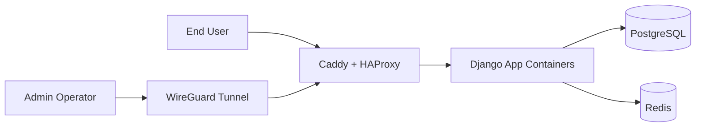

# Proxmox Enterprise Lab

Infrastructure design and implementation lab for running a Dockerized Django platform on Proxmox using Terraform and Ansible.

## Introduction

This repository documents a practical platform engineering lab that targets enterprise-style structure on constrained hardware.  
The goal is to build a repeatable staging and production setup with clear separation between provisioning (`Terraform`) and configuration/deployment (`Ansible`).

This README is intentionally architecture-first and overview-only. Detailed deployment runbooks are out of scope for v1.

## Current Infrastructure Constraints

The current baseline is a single Debian server running one Proxmox node.

| Resource | Value |
| --- | --- |
| Sockets | 1 |
| Cores | 4 |
| RAM | 16 GB |
| Disk | 90 GB |
| CPU type | `host` |
| Machine | `q35` |
| BIOS | `OVMF (UEFI)` |

Design implication: this is production-structured but not true high availability, because the physical host is still a single point of failure.

## Environment Strategy

Two environments are planned and organized in this repository:

- `staging` is the first environment to validate IaC and release workflows safely.
- `prod` mirrors the same patterns with stricter controls and production data handling.

High-level intent:

| Environment | Primary Use |
| --- | --- |
| `staging` | Validation, integration testing, safe iteration |
| `prod` | Stable user-facing service |

## Architecture Overview

Per environment, traffic follows this pattern:

1. Public requests reach the edge tier.
2. Edge tier terminates TLS and routes traffic to app tier.
3. App tier runs Dockerized Django workloads.
4. Admin access is restricted through WireGuard.



Both `staging` and `prod` follow this topology, with environment-specific sizing and data boundaries.

## Repository Layout

```text
.
├── ansible/
│   ├── inventories/
│   │   ├── staging/
│   │   └── production/
│   ├── playbooks/
│   └── roles/
├── docs/
└── terraform/
    ├── modules/
    └── live/
        ├── staging/
        │   ├── edge/
        │   ├── app/
        │   └── observability/
        └── prod/
            ├── edge/
            ├── app/
            └── observability/
```

Layout principles:

- `terraform/modules`: reusable building blocks.
- `terraform/live/*`: environment and stack-specific entrypoints with separate state boundaries.
- `ansible/inventories/*`: environment separation for host data and variables.
- `ansible/roles`: reusable configuration roles across environments.

## Documentation

- Diataxis hub: `docs/README.md`
- Reference index: `docs/reference/README.md`
- Current node disk specification: `docs/reference/proxmox-node-disk-layout.md`
- Project plan: `PROJECT_PLAN.md`

## Design Principles

- Reproducibility: infrastructure and host configuration are code-defined.
- Separation of concerns: provisioning and service configuration are independent workflows.
- Low blast radius: stack-per-environment Terraform layout avoids monolithic state.
- Security baseline: VPN-based admin access, explicit ingress boundaries, secret separation by environment.

## Scaling Roadmap

### Now

- Stabilize single-node staging and production structure.
- Keep environment parity at architecture level.
- Enforce clean separation of environment configs and secrets.

### Next

- Add backup and restore automation with regular recovery drills.
- Add centralized monitoring/logging stack in `observability`.
- Formalize release promotion from `staging` to `prod`.

### Later

- Evolve from single node to multi-node Proxmox cluster.
- Externalize state and secret management with stronger controls.
- Introduce higher-availability patterns at compute and data layers.

## Non-Goals (v1)

- Full command-by-command deployment tutorial.
- Full SRE operating handbook.
- Multi-node HA implementation details.

## Status

Current status: foundational repository structure is in place, with environment and stack boundaries defined.  
Next documentation targets: deployment workflow and operations runbook.
